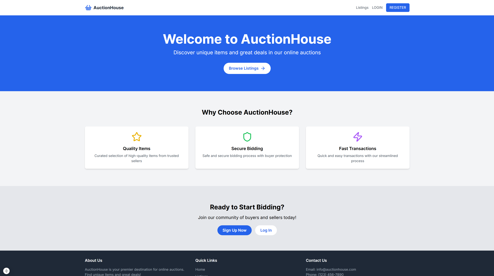
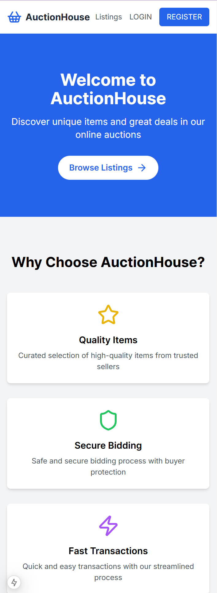

## Project Overview

AuctionHouse is an online platform where users can list items for auction and place bids on items listed by others. The project demonstrates the use of Next.js for building a modern web application with server-side rendering and static site generation.

## Screenshots

| Desktop                               | Mobile                              |
| ------------------------------------- | ----------------------------------- |
|  |  |

## Features

- User authentication and authorization
- Create, read, update, and delete (CRUD) operations for auction items
- Real-time bidding system
- User profiles and dashboards
- Responsive design for mobile and desktop

## Technologies Used

- Next.js
- React
- TypeScript
- Tailwind CSS
- Vercel (for deployment)

## Getting Started

1. Clone the repository:

```bash
git clone git@github.com:martink-rsa/noroff-project-exam-2.git
```

2. Install dependencies:

```bash
cd noroff-project-exam-2
npm install
```

3. Run the development server:

```bash
npm run dev
```

4. Open [http://localhost:3000](http://localhost:3000) in your browser.
